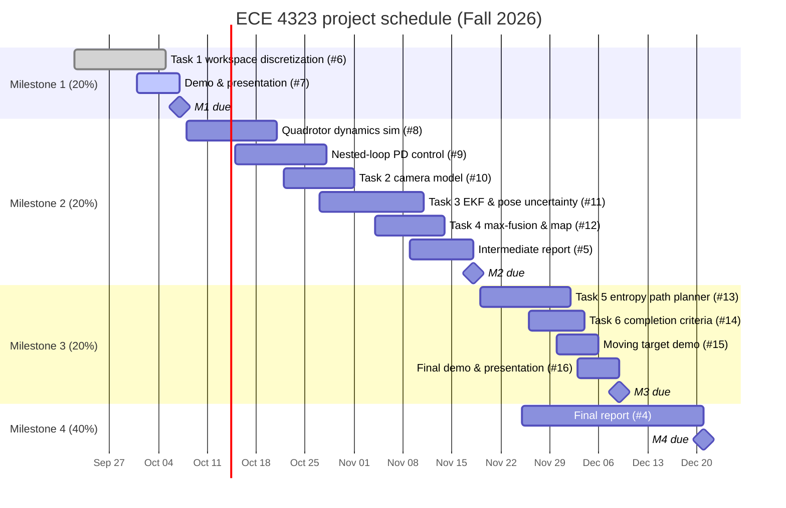

# ECE 4323 Project — Probabilistic Field Coverage with a Flying Camera

Course project for ECE 4323 (Modern Control Systems), University of New Brunswick.
A quadrotor with a downward-facing camera surveys a rectangular ground workspace,
builds a probabilistic confidence map under pose and measurement uncertainty, and
plans its path to reduce map entropy.

The full brief is in [`docs/ECE_4323_Project_Description_Flying_Robot_Camera.pdf`](docs/ECE_4323_Project_Description_Flying_Robot_Camera.pdf).

## Schedule

Each bar has a matching GitHub issue (milestones #1–#4, tasks as sub-issues).
Diamonds mark the deadlines in the brief.

| Milestone | Due | Deliverables | Weight |
|---|---|---|---|
| 1. Setup | Oct 7 | Task 1: workspace discretization, oral demo | 20% |
| 2. Basic operation | Nov 18 | Tasks 2–4: quadrotor simulation, camera model, EKF pose uncertainty, max-fusion, intermediate report | 20% |
| 3. Final demo | Dec 9 | Tasks 5–6: entropy-based path planning, mission completion, moving-target demo, presentation | 20% |
| 4. Final report | Dec 21 | Final technical report | 40% |

Start dates are suggestions; deadlines come from the brief.
